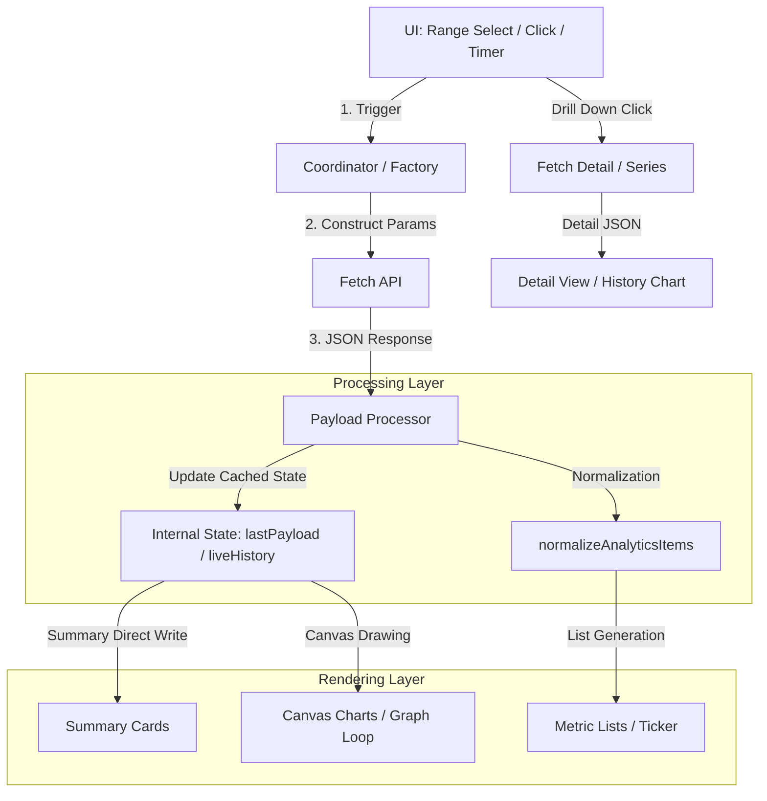

# Admin Analytics Logic

This document provides a comprehensive map of the internal functions and data structures within the `admin/analytics/` module.

## Table of Contents
- [💡 Core Concepts](#-core-concepts)
- [🔌 Module Initialization](#-module-initialization)
- [🔄 Data Flow](#-data-flow)
- [🖼️ DOM Dependencies](#️-dom-dependencies)
- [📈 live.js](#-livejs)
- [📖 reader.js](#-readerjs)
- [📊 reads-over-time.js](#-reads-over-timejs)
- [🚦 traffic.js](#-trafficjs)
- [🕰️ visitor-history.js](#️-visitor-historyjs)
- [🛠️ shared.js](#️-sharedjs)

## 💡 Core Concepts

To understand these modules, keep the following identifiers in mind:
- **`entryKey`**: A string in the format `<seriesId>:<displayNumber>` (e.g., `battle-bros:5`). This is the primary key used to link reader events to database entries.
- **`displayNumber`**: The human-readable ID of an entry (Chapter 1, Chapter 2). The analytics backend parses this from event labels.
- **`liveHistory`**: A rolling array of samples stored in `localStorage` to ensure the live seismometer doesn't reset on page refresh.

## 🔌 Module Initialization

The analytics system uses a factory pattern. Individual sub-modules are initialized in the main `admin/analytics.js` coordinator:

```javascript
import { createLiveAnalytics } from './analytics/live.js';
import { createReaderAnalytics } from './analytics/reader.js';
// ... other imports

function createAnalytics() {
  const live = createLiveAnalytics();
  const reader = createReaderAnalytics();
  // ... wiring up controls and returning public facade
  return {
    refreshAnalytics: () => { /* triggers all modules */ },
    startLiveVisitors: live.startLiveVisitors,
    // ...
  };
}
```

## 🔄 Data Flow

The following diagram illustrates how data moves from the API to the user interface:



### 1. Trigger Phase
Analytics refreshes are triggered by:
- **Interval Polling**: `live.js` (every 5m) and various loaders on first mount.
- **User Input**: Select elements for time range or filters.
- **Interactions**: Clicking a list item to "drill down" into specifics.

### 2. Fetch Phase
Loaders (e.g., `loadReaderAnalytics`) assemble `URLSearchParams` using standard getters like `getReaderRange()`. Requests are made to `backend/app/routes/admin_analytics.py` endpoints.

### 3. Processing Phase
- **Buffering**: Real-time data is smoothed into the `liveHistory` array.
- **Normalization**: Diverse API payloads are mapped to a consistent object shape for lists.
- **Persistence**: Real-time samples are saved to `localStorage` for session continuity.

### 4. Rendering Phase
- **DOM Injection**: Summary stats and lists are injected as HTML strings with data attributes.
- **Canvas Rendering**: Charts use a `requestAnimationFrame` loop (for pulse/live) or a single-pass draw (for history) using high-DPI scaling.
- **Ticker Animation**: Marquee elements use a scroll-based animation loop.

## 🖼️ DOM Dependencies

The analytics modules rely on a global `el` object (defined in `admin/dom.js`) which contains cached `document.getElementById` references. If these IDs are missing from the HTML, the modules will fail gracefully (null-checking is applied throughout).

### Live Analytics (`live.js`)
- **Containers**: `liveVisitorsChart`, `liveVisitorsTicker`, `liveVisitorsTrack`
- **Controls**: `liveVisitorsRange`, `btnLiveVisitorsZoomOut`, `btnLiveVisitorsZoomIn`, `btnLiveVisitorsRefresh`
- **Labels**: `liveVisitorsStatus`, `liveVisitorsCount`, `liveVisitorsRangeLabel`, `liveVisitorsAxisStart`

### Reader Analytics (`reader.js`)
- **Metric Lists**: `analyticsEntryReads`, `analyticsSeriesReads`, `analyticsEntryRates`, `analyticsSeriesRates`
- **Stat Cards**: `statEntryReads`, `statEntryStarts`, `statFinishRate`, `statUniqueVisitors`
- **Trend Indicators**: `statEntryReadsTrend`, `statEntryStartsTrend`, `statFinishRateTrend`
- **Health/Insights**: `analyticsHealth`, `healthDot`, `healthTitle`, `healthSummary`, `analyticsInsight`
- **Weekly Digest**: `weeklyDigestCard`, `weeklyDigestReads`, `weeklyDigestStarts`, `weeklyDigestCompletionRate`, `weeklyDigestVisitors`
- **Controls**: `analyticsReaderRange`, `analyticsReaderSeries`, `tabEntry`, `tabSeries`, `analyticsReaderStatus`

### Reads Over Time (`reads-over-time.js`)
- **Visuals**: `readsOverTimeCanvas`, `readsOverTimeTotals`
- **Controls**: `readsOverTimeRange`, `readsOverTimeMode`, `readsOverTimeEntry`, `readsOverTimeStatus`

### Traffic Analytics (`traffic.js`)
- **Summary Numbers**: `statViews24h`, `statVisitors24h`, `statViews7d`, `statVisitors7d`
- **Main Lists**: `analyticsPagesList`, `analyticsLandingPagesList`, `analyticsReferrersList`, `analyticsCountriesList`, `analyticsBrowsersList`, `analyticsDevicesList`, `analyticsEventsList`
- **Controls**: `analyticsPagesRange`, `analyticsStatus`, `analyticsPagesStatus`

### Visitor History (`visitor-history.js`)
- **Panels**: `analyticsVisitorHistoryList`, `analyticsVisitorHistoryDetail`
- **Controls**: `analyticsVisitorHistorySearch`, `analyticsVisitorHistorySort`
- **Metadata**: `analyticsVisitorHistoryStatus`, `analyticsVisitorHistoryMeta`

## 📈 live.js

The `createLiveAnalytics` factory function manages the real-time "Seismometer" chart and visitor ticker.

### Internal State
- `liveHistory`: Array of `{timestamp, count}` recorded over the current session.
- `liveTickerOffset`: Current scroll position of the visitor marquee.
- `liveHistorySeconds`: The duration window currently shown on the chart.

### Public API (🔌)

#### `startLiveVisitors()`
Initializes the polling loop and the ticker animation.

#### `stopLiveVisitors()`
Clears all active intervals and pauses the animation loop.

#### `shiftLiveRange(direction)`
Increments or decrements the time range selection (30m, 60m, 2h, 6h, 12h, 24h) and re-loads data.

### Internal Helpers (🔒)

#### `getLiveRangeSeconds()`
Converts the select menu's duration string (e.g., "30m") into raw seconds.

#### `setLiveStatus(message, isError)`
Updates the status message for the live visitor section.

#### `recordLiveSample(count)`
Adds a new visitor count to `liveHistory`.
> [!NOTE]
> Points recorded within the same 60-second window replace the previous point rather than appending, preventing the chart from becoming overcrowded.

#### `saveLiveHistory()`
Persists the current history and timestamp to `localStorage`.

#### `loadLiveHistory()`
Restores previous session history from `localStorage` if it's less than 24 hours old.

#### `drawLiveSeismometer()`
The main rendering loop for the Canvas chart. Uses a `requestAnimationFrame` cycle to create a smooth, "pulsing" line effect and scrolling grid.

#### `loadLiveVisitors({ showLoading })`
Fetches current active visitor data from `/api/admin/analytics/live`.

#### `renderLiveTicker(visitors)`
Generates individual visitor cards (with country flags and current path) and pushes them into the ticker track.

#### `animateLiveTicker()`
Recursively updates the `transform` of the ticker track to create an infinite scroll effect.

## 📖 reader.js

The `createReaderAnalytics` factory function manages long-term engagement metrics, retention rates, and historical trend charts.

### Internal State
- `lastWeeklyDigest`: Comparison data for week-over-week trends.
- `activeReaderDetails`: A `Map` storing the state of active drill-down views.
- `lastReaderPayload`: The raw data from the last engagement fetch.

### Public API (🔌)

#### `loadReaderAnalytics({ showLoading })`
Top-level async loader that fetches fresh engagement data and triggers the entire rendering pipeline.

#### `renderReaderAnalyticsView()`
Triggers a re-render of the current view using cached data.

#### `fetchWeeklyDigest()`
Async fetch for the comparison data used to show week-over-week changes.

#### `renderHealthIndicator()`
Updates the dashboard's health status dot and generated summary text based on current performance.

#### `updateSummaryTrends()`
Injects the trend arrows/percentages into the summary cards.

### Internal Helpers (🔒)

#### `calculateHealthStatus(...)`
Determines the "Health" of the site (Good, Neutral, Concern) by comparing finish rates and weekly growth.

#### `formatTrendHtml(changeObj)`
Returns an HTML arrow (↑, ↓, →) for visual trend indicating.

#### `generateInsightSentence(payload)`
Generates a human-readable "headline" about the top-performing entry.

#### `normalizeAnalyticsItems(...)`
Standardizes raw API items into a consistent object structure.

#### `renderAnalyticsList(...)`
Generic bar-chart renderer for "Top Reads" and "Rates" lists. 
> [!TIP]
> This function calculates relative rankings and color-codes high/low outliers automatically.

#### `renderReaderDetail(target, detail)`
Renders the detailed "Drill Down" view, including the bar chart and historical metadata.

#### `loadReaderSeries(...)`
Fetches historical time-series data for the detail chart.

## 📊 reads-over-time.js

The `createReadsOverTimeAnalytics` factory function manages the historical "Pages Read" line chart.

### Public API (🔌)

#### `loadReadsOverTime({ showLoading })`
Async fetcher that pulls raw time-series data and triggers a chart update.

#### `setReaderPayload(payload)`
Updates the local entry options whenever the main analytics payload is refreshed.

### Internal Helpers (🔒)

#### `drawReadsOverTimeChart()`
The primary Canvas rendering engine for the historical line graph. 
> [!IMPORTANT]
> This uses High-DPI (Retina) scaling and custom neon glow effects for the line paths.

#### `updateReadsOverTimeEntryOptions(payload)`
Populates the entry selector. It automatically adds series context (e.g., "Series · Chapter 1") if multiple entries share the same label.

## 🚦 traffic.js

Manages site-wide traffic summaries and acquisition demographics.

### Public API (🔌)

#### `loadAnalyticsSummary({ showLoading })`
Async fetch from `ANALYTICS_ENDPOINT` for high-level site totals.

#### `loadAnalyticsPages({ showLoading })`
Async fetch from `ANALYTICS_PAGES_ENDPOINT` for the top-performing paths.

#### `loadAnalyticsVisitors({ showLoading })`
Async fetch from `ANALYTICS_VISITORS_ENDPOINT` for demographics.

### Internal Helpers (🔒)

#### `renderMetricList(...)` / `renderExpandedMetricList(...)`
Standard bar-chart renderers for traffic breakdowns.

#### `formatBounceRate(item)` / `formatAverageVisitTime(item)`
Engagement calculation helpers.

## 🕰️ visitor-history.js

Manages the granular "Visitor History" explorer.

### Public API (🔌)

#### `loadVisitorHistory({ showLoading })`
Async fetch from `ANALYTICS_VISITOR_HISTORY_ENDPOINT`.

### Internal Helpers (🔒)

#### `buildVisitorHistorySearchText(visitor)`
Generates a searchable string for local filtering.

#### `renderVisitorHistoryDetail(visitor)`
Renders the right-hand panel with reading progress and metadata.

## 🛠️ shared.js

Stateless utility functions used for consistent formatting.

- `formatStat(value)`: Returns comma-separated numbers or `—`.
- `formatTimeAgo(value)`: Returns "Xm ago" style strings.
- `getCssVar(name, fallback)`: Reads from `:root` for canvas color syncing.
- `escapeHtml(value)`: Basic security sanitization.
