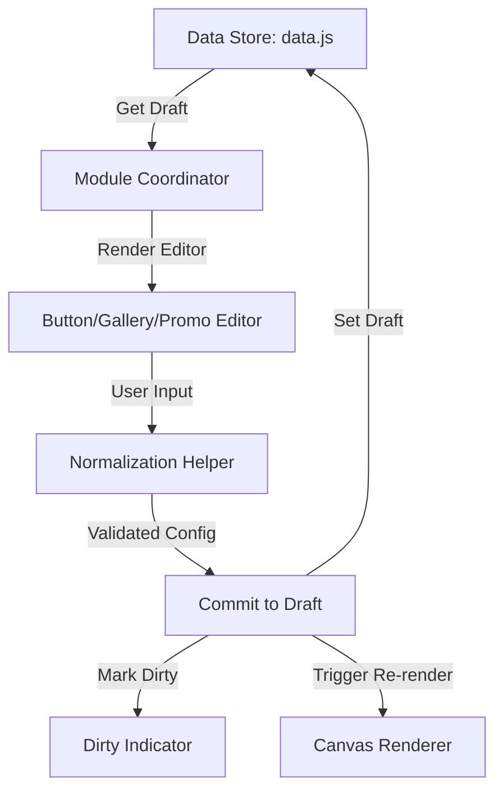

DO NOT USE AS REFERENCE, THE LOGIC IS FLAWED.

# Admin Page Builder Logic

This document provides a comprehensive map of the internal functions and data structures within the `admin/page-builder/` module.

## Table of Contents

- [💡 Core Concepts](#-core-concepts)
- [🔌 Module Initialization](#-module-initialization)
- [🔄 Data Flow](#-data-flow)
- [⚙️ Configuration & Registries](#️-configuration--registries)
- [🖼️ DOM Dependencies](#️-dom-dependencies)
- [📡 data.js](#-datajs)
- [📁 The Side Navigation (Rail)](#-the-side-navigation-rail)
- [🎮 module-editor.js](#-module-editorjs)
- [🗳️ The Inspector (Sidebar)](#️-the-inspector-sidebar)
- [🔝 The Page Header](#-the-page-header)
- [🛠️ Shared Utilities](#️-shared-utilities)
- [🖌️ Rendering Layer](#️-rendering-layer)
- [🖱️ Interaction Layer](#️-interaction-layer)
- [🔗 link-utils.js](#-link-utilsjs)
- [🔘 button-editor.js](#-button-editorjs)
- [📏 divider-editor.js](#-divider-editorjs)
- [🖼️ gallery-editor.js](#️-gallery-editorjs)
- [📼 video-editor.js](#-video-editorjs)
- [🗂️ entry-gallery-editor.js](#️-entry-gallery-editorjs)
- [📱 social-editor.js](#-social-editorjs)
- [✨ promo-editor.js](#-promo-editorjs)
- [🎨 theme-editor.js](#-theme-editorjs)
- [📑 sidebar-panel.js](#-sidebar-paneljs)

## 💡 Core Concepts

The Page Builder is a high-performance drafting environment built around the following architectural pillars:

### 1. The Living State (`draftConfig`)

The "Source of Truth" for any active editing session is a plain JSON object managed by `data.js`.

- **Ephemeral Storage**: Changes are held in memory until an explicit **Save** action persists them.
- **Dirty Tracking**: A `markDirty` callback manages the UI's Save/Discard/Dirty indicator lifecycle.

### 2. Normalization (The Type Guard)

Every component implements a `normalize...Config` function.

- **Integrity**: These functions ensure renderers always receive valid types and defaults, preventing crashes on malformed or legacy data.
- **Just-In-Time Migration**: Normalization acts as a translation layer for evolving data structures without requiring bulk DB migrations.

### 3. Structural Hierarchy

Layouts are composed using a strict container-based hierarchy:

- **Page**: Holds global metadata (Slug, Type, Theme).
- **Section**: The layout container (defines grid patterns like `1-2`, `1-1-1`, or `1-3-1`).
- **Column**: A vertical grouping within a section layout.
- **Module**: Atomic content units (Text, Image, Promo, etc.).

### 4. Technical Parity (Shared Renderers)

The builder uses the exact same rendering logic (`shared-renderers.js`) as the live frontend reader.

- **Environment Bridging**: `preview-renderers.js` configures the shared pipeline for Admin (resolving asset roots, stubbing forms).
- **Canvas Furniture**: `canvas-renderer.js` injects the interactive "Admin Layers" (reorder handles, insert zones) onto the raw module HTML.

### 5. Dual Synchronization

The system maintains a real-time feedback loop. When a module is edited:

1. The **Draft** is updated in the store.
2. The **Inspector (Sidebar)** rerenders to ensure inputs and labels are in sync with the state.
3. The **Canvas** specifically rerenders the targeted module/section to maintain visual parity.

## 🔌 Module Initialization

The builder components are typically initialized within the `module-editor.js` or `page-builder.js` coordinators. Editors are bound to the DOM whenever a specific module is selected for editing.

### Canonical Designer Entry

The integrated builder is now the only real Page Designer shell.

- The admin shell opens designer mode through the canonical route
  `admin/index.html?view=designer&series=<id>&page=<slug>&surface=header`.
- In designer mode, the builder resolves a target page, opens the shell, and immediately selects
  the page-header editor.
- Legacy `admin/designer.html` is only a redirect bridge into that builder route.

## 🔄 Data Flow

## 🖼️ DOM Dependencies

The builder relies on specific areas of the Admin Shell:

- `#pbModuleEditor`: The sidebar panel where editor forms are rendered.
- `#pbCanvas`: The live preview area.
- `.pb-[module]-input`: Context-specific classes used for event delegation.

## ⚙️ Configuration & Registries

### `constants.js`

The central registry for the builder's capabilities and styling definitions.

- **`MODULE_TYPES`**: The master list of all supported modules. It defines the icon and category for each type, which determines their placement in the inline **Module Picker**.
- **`LAYOUT_OPTIONS`**: A set of valid column configurations for sections. The `value` (e.g., `1-2`) is parsed by `canvas-renderer.js` to set the grid template.
- **`THEME_COLORS`**: Defines the logical color tokens available for use across the site.
- **`THEME_PRESETS`**: A collection of predefined color palettes that can be applied to the page through the **Theme Editor**.

## 📡 data.js

The data layer responsible for all asynchronous communication with the backend.

### Async Fetchers

- `fetchPages(seriesId)`: Retrieves all pages for a series.
- `fetchPage(pageId)`: Retrieves full detail for a single page.
- `fetchAssets()`: Loads the list of available images/media.

### Async Mutators

- **Pages**: `createPage(...)`, `deletePage(...)`, `updatePage(pageId, data)`, and `reorderPages(seriesId, pageIds)`.
- **Sections**: `addSection(...)`, `updateSection(sectionId, data)`, `deleteSection(sectionId)`, and `reorderSections(pageId, sectionIds)`.
- **Modules**: `addModule(...)`, `updateModule(moduleId, data)`, `deleteModule(moduleId)`, `moveModule(moduleId, targetSectionId, columnIndex, sortIndex)`, and `reorderModules(sectionId, columnIndex, moduleIds)`.
- **Assets**: `uploadAsset(file, readFileAsBase64)`: Handles base64-encoded binary transfers to the asset gallery.

## 🎮 module-editor.js

The orchestrator that manages the editor sidebar. It acts as a switchboard that renders the correct sub-editor based on the `moduleType`.

### Logic & View Orchestration

- **`renderModuleEditorContent(...)`**: The main entry point for the sidebar. It renders a summary header and then either delegates to specialized renderers or inlines fields for generic types.
- **`bindModuleEditorEvents(...)`**: The event switchboard. It delegates the binding lifecycle to specific sub-editors or the shared generic binder.

### The Generic Module System

For modules without an isolated `.js` coordinator (`text`, `image`, `spacer`, `html`, `email-signup`, and `reader`), the system uses a convention-based field binder:

- **`collectGenericModuleDraft(root, baseConfig)`**: Scrapes inputs with `[data-key]` for top-level config and `[data-style-key]` for nested style objects.
- **`bindGenericModuleDraftEvents(...)`**: A shared utility that standardizes the "change/input" lifecycle for any module using generic fields.
- **`renderRawConfigCard(config)`**: Renders a toggleable JSON editor for advanced configuration.

### UI Metadata

- **`getModuleSummary(moduleType, config)`**: Generates human-friendly descriptions used in the sidebar and canvas (e.g., "40px spacer").
- **`formatModuleLabel(moduleType)`**: Converts internal module slugs (e.g., `entry-gallery`) to human-readable titles (`Entry Gallery`).

## 🗳️ The Inspector (Sidebar)

### `editor-panel.js`

The "Shell" of the editor sidebar. It manages the layout of the property inspector and routes between different specialized editors.

- **`createEditorPanelRenderer({ el, getState, actions, ... })`**: Returns the `renderEditorPanel` function. It is responsible for:
  - Initializing draft states (Theme, Header, Module, or Page Settings) via `actions`.
  - Selecting the correct view renderer based on `state.activeEditorTab` and `state.selectedCanvasSurface`.
  - Managing the sidebar lifecycle (Save/Discard/Reset buttons).
- **`renderShell`**: The common layout wrapper for all sidebar views. It includes the **Kicker** (context label), the **Header**, and the **Tabs**.
- **`renderTabs`**: The primary switcher between **Modules** and **Theme**.
- **`renderFooter`**: A context-aware action bar that renders dynamic buttons (Save/Discard/Delete) based on the current editing scope.
- **Page Settings**: An internal renderer for editing page metadata (URL slug, title, type, and homepage status).

## 📁 The Side Navigation (Rail)

### `sidebar-panel.js`

Manages the global navigation and library rail, distinct from the module inspector.

- **`renderPageList()`**: Renders the stack of active builder pages.
  - **Management**: Provides triggers for page selection and deletion.
  - **Reordering**: Implements a native Drag-and-Drop lifecycle that allows authors to visually reorder the series' page hierarchy via `reorderSidebarPages`.
  - **Designer Route Sync**: When the shell was entered through the canonical designer route,
    page selection keeps the URL aligned with the active page slug.
- **`renderModulePalette()`**: Renders the library of available module types.
  - **External Drag**: Configures native drag-and-drop objects that can be dropped onto the canvas **Insert Zones** to create new module instances.
- **`bindSidebarTabs()`**: Orchestrates the view-switching logic between the "Pages" and "Library" tabs within the sidebar rail.

## 🔝 The Page Header

### `header-config.js`

The source of truth for header structure and metadata overrides. It manages the resolution lifecycle from raw database JSON to an "Effective Header."

- **Block Registries**: Defines the 5 standard header zones: `brand` (Logo/Title), `patron` (Welcome), `status` (Announcements), `entryControls` (Chapter navigation), and `nav` (Page links).
- **`createEffectivePageHeader(page, pageConfig, ...)`**: The primary resolution engine. It calculates the final header state by cascading through:
  1. Per-page `meta.header` (V3).
  2. Site-wide default header (Global config).
  3. Legacy overrides (`meta.headerOverrides`).
  4. Legacy in-section header modules (for title/subtitle fallback).
- **Normalization**:
  - `normalizeHeaderConfig`: Deduplicates blocks across regions and ensures they exist in the registry.
  - `normalizeHeaderCopy`: Merges page-specific titles and subtitles with global fallbacks.
- **Migration Audits**: `auditPagesFallbacks` generates reports on "stale" or "missing" V3 header metadata to guide cleanup phases.

### `header-editor.js`

The UI component for the header sidebar. It manages complex multi-stage updates and real-time synchronization with the canvas.

- **`renderHeaderEditorContent(...)`**: The primary renderer for the header inspector. It aggregates several modular sub-sections:
  - **Copy Editor**: Title and rotating subtitles (one per line).
  - **Navigation Editor**: Management list for header buttons.
  - **Parts Editor**: Visibility toggles for the 5 global block types (`brand`, `patron`, `status`, etc.).
  - **Placement Editor**: The "Layout Board" for moving blocks between `left`, `center`, and `right` regions.
- **`bindHeaderEditorEvents(...)`**: Orchestrates event delegation for the entire header inspector. Uniquely, it often triggers a **Dual Rerender**—updating both the sidebar (to refresh placement button states) and the canvas (for visual parity).
- **Internal Helpers (🔒)**: Includes a suite of `moveBlock...` functions that handle the logic of reordering the `regions` object within the configuration state.

## 🛠️ Shared Utilities

### `helpers.js`

Stateless utility functions used for data normalization, asset resolution, and DOM safety.

- **`normalizeFit(value)`**: Standardizes "Image Fit" strings to either `contain` or `cover`.
- **Focal Point Logic**:
  - `parseFocus(value)`: Converts keywords (`top`, `bottom left`) or percentage strings into an `{ x, y }` coordinate object.
  - `formatFocus({ x, y })`: Converts a coordinate object into a CSS-ready `background-position` string (e.g., `50% 50%`).
- **`resolveAssetUrl(path)`**: Ensures image paths are correctly formatted for the file system (prefixing `/assets/` where necessary).
- **Security**: Provides `escapeHtml` and `escapeAttr` for safe DOM injection of user-provided configurations.

### `sanitize.js`

The centralized security and normalization layer. It provides deep-inspection sanitization for HTML and strict validation for all configuration primitives.

- **HTML Sanitization**:
  - **`sanitizeBuilderHtml(value, mode)`**: Parses raw strings into a virtual DOM and strips dangerous tags/attributes.
  - **Modes**: `text` (basic formatting like `strong`, `em`, `a`) or `html` (includes layout tags like `div`, `section`, `figure`).
- **Media & URL Safety**:
  - **`sanitizeVideoUrl(value)`**: Restricts URLs specifically to **YouTube** and **Vimeo** domains to ensure compatibility with shared renderers.
  - **`sanitizeAssetUrl(value)`**: Validates image paths while stripping fragment identifiers and restricted protocols.
- **Primitive Normalizers**:
  - **`sanitizeColor(value, fallback)`**: Validates against Hex, RGB/RGBA, HSL, and CSS named colors.
  - **`sanitizeNumber(value, fallback, min, max)`**: Clamps numeric inputs to safe ranges (e.g., preventing negative dimensions).
  - **`sanitizeKeyword(value, allowed, fallback)`**: Enforces strict enum-style validation for string constants.

## 🖌️ Rendering Layer

The builder uses a multi-stage rendering pipeline to maintain high performance while ensuring technical parity with the live site.

### `shared-renderers.js`

The single technical source of truth for module HTML output. It ensures the Admin Canvas and the Frontend Reader are always in sync.

- **`createRenderers(options)`**: A factory that produces environment-aware rendering functions:
  - **`renderPage(page)`**: The top-level orchestrator for section stacks.
  - **`renderSection(section)`**: Translates layout keys (e.g., `1-2`, `1-1-1`) into optimized CSS layouts and applies section-level backgrounds and spacing.
  - **`renderModule(module)`**: Wraps content in standard builder attributes (`data-module-id`) for interaction tracking.
- **Module Registry**: Supports 15+ types, including:
  - **Structural**: `spacer`, `divider`, `header`.
  - **Content**: `text` (HTML), `image`, `gallery`, `html` (bespoke).
  - **Media**: `video` (auto-detects YouTube/Vimeo IDs for iframe embedding).
  - **Interactive**: `buttons`, `social`, `email-signup`.
  - **Dynamic**: `reader`, `feed`, `entry-gallery` (supports "Mount Placeholders" for developer/author visibility).

### `promo-renderer.js`

The specialized renderer for the **Promo (Carousel)** module. It handles the translation of complex slide-based drafting into high-performance, CSS-driven markup.

- **Neon Styling Engine**:
  - **Color Math**: Automatically converts Hex colors to RGBA to apply user-defined `backgroundOpacity` for glassmorphism effects.
  - **Glow Calculation**: Dynamically generates `text-shadow` and `box-shadow` values based on accent colors and glow intensity.
- **Dynamic Layouts**: Supports per-slide layout positioning, dynamically altering the DOM structure for `overlay` vs. `outside` (text above/below) orientations.
- **Defensive Rendering**: Sanitizes and clamps all numeric values (Height, Interval) and keywords (Transition Style) to ensure a stable preview even with malformed draft state.
- **Context Awareness**: Utilizes environment-specific asset resolvers to ensure image paths are corrected during the draft preview.

### `preview-renderers.js`

A bridge that configures the shared rendering pipeline for the Admin environment and implements "Preview-only" interactive hooks.

- **Renderer Configuration**: Calls `createRenderers` (from `shared-renderers.js`) with admin-specific settings:
  - `resolveImageUrl`: Resolves assets relative to the admin root (`../assets/...`).
  - `showMountPlaceholders`: Ensures interactive regions (like comments or feeds) show a structural placeholder in the canvas.
- **`setPreviewSeriesId(id)`**: Sets the context for the current series, allowing button links to resolve to the correct reader URLs in the preview.
- **`initPreviewPromoCarousels(container)`**: Implements the carousel transition logic (auto-rotate, navigation buttons, and indicators) for the Admin Canvas, as the standard reader JS does not run within the builder environment.
- **`initPreviewEmailForms(container)`**: Stubs out SUBMIT actions for email modules. It prevents real POST requests while providing visual feedback that the form is "working."

### `canvas-renderer.js`

Responsible for the **Structural Wrapper** and the interactive "Admin-only" layers of the canvas.

- **`renderCanvasSnapshot({ state, helpers })`**: The main orchestration export that returns the full canvas and page title HTML.
- **Page Title Bar**: Renders the context header showing the current page slug, type, and status badges, along with the "Page Settings" access point.
- **Page Header Surface**: A specialized structural preview of the site-wide header. It visualizes the current Brand and Navigation configuration as a clickable block (delegated to `header-config.js`).
- **Section Controls**: Renders section reorder handles, layout selectors, and the **Section Settings** overlay for controlling Module Gap, Column Gap, and Section Gap values.
- **Insert Zones**: Manages the placement of `renderModuleInsertBar` and `renderSectionInsertBar` and the rendering of the inline **Module Picker** grid.

## 🖱️ Interaction Layer

### `canvas-events.js`

Coordinates all user interactions within the `#pbCanvas` through a factory pattern.

- **`createCanvasEventBinder({ el, getState, actions })`**: Returns a `bindCanvasEvents` function. This module detaches business logic from DOM events by delegating all operations to the passed `actions` object.
- **Section Management**: Handles `insert-section`, reordering (Native Drag & Drop), layout changes, and toggleable section spacing settings (Module GAP, Column GAP, Section GAP).
- **Module Management**: Handles selection clicks, deletion, and the module picker (both click-based and via dragging a module type into an insert bar).
- **Global Selection**: Hooks up buttons for selecting the Page Header and Page Settings from the canvas.

### `page-builder.js`

The top-level coordinator now owns the canonical designer-entry behavior in addition to the generic
builder shell.

- **`showPageBuilderSection(options)`**: Opens the builder in either normal builder mode or
  designer mode.
  - `entrypoint: 'designer'` activates route-aware header editing.
  - `pageSlug` requests a specific page by slug.
  - `surface: 'header'` opens the structured page-header editor immediately.
  - `historyMode` controls whether route updates use `pushState` or `replaceState`.
- **Default Page Resolution**: Designer mode resolves pages in this order: requested slug,
  `reader`, homepage, then first page in sort order.
- **`onSeriesChange()`**: Re-opens the visible builder shell after a series switch and preserves
  designer-mode routing when applicable.

## 🔗 link-utils.js

A shared utility library for manipulating and normalizing links across the builder and various modules.

### Public API (🔌)

#### `normalizeLinkTarget(rawTarget, legacyUrl)`

The central normalization engine for links. It converts raw inputs into a consistent object containing `kind`, `pageSlug`, `url`, `hash`, and `openInNewTab`.

#### `resolveLinkTargetHref(target, options)`

Converts a normalized link object into a final string URL (e.g., `index.html?series=...&page=...` for internal pages).

### Specialized Normalizers

- **`normalizeHeaderNavItems(items)`**: Normalizes the list of links for the site-wide header.
- **`normalizeButtonsConfig(config)`**: Ensures a "Buttons" module configuration has a valid array of styled link objects.
- **`normalizeHeaderNavItem` / `normalizeButtonItem`**: Internal item-level normalizers that generate unique IDs and default labels.

### URL Construction & Validation

- **`buildReaderPageHref(pageSlug, seriesId)`**: The shared logic for generating live reader URLs (e.g., `index.html?series=battle-bros&page=my-page`).
- **`shouldOpenLinkInNewTab(target)`**: Returns `true` only if the link is an external `url` (http/https) and the `openInNewTab` flag is set.
- **`isBuilderPageTargetMissing(target, pages)`**: Checks if a selected destination page exists in the current series.
- **`sanitizePageSlug(raw)`**: Strips invalid characters to ensure a lowercase, URL-safe slug.

## 🔘 button-editor.js

The `button-editor.js` module provides the UI and logic for managing lists of interactive buttons.

### Public API (🔌)

#### `renderButtonsEditor(config, pages)`

Generates the HTML string for the buttons configuration form.

- `config`: The current buttons module configuration.
- `pages`: The list of available builder pages (used for internal link selection).

#### `bindButtonsEditorEvents({ el, draftConfig, setDraftConfig, renderEditorPanel, markDirty })`

Attaches event listeners to the editor form.

- Handles adding, removing, and reordering buttons.
- Syncs input changes (labels, styles, links) back to the draft state.

#### `cloneButtonsConfig(config)`

Returns a deep-clone of a normalized buttons configuration.

### Internal Helpers (🔒)

#### `cloneValue(value)`

A deep-clone utility using `JSON.parse(JSON.stringify(...))`.

#### `renderLinkFields(button, index, pages)`

Generates specialized sub-fields for the "Link" configuration (Switching between Builder Page, URL, and Anchor).

#### `setLinkValue(button, key, input)`

Updates a button's link object based on user input, ensuring that switching the link "kind" resets irrelevant fields.

## 📏 divider-editor.js

A minimalist editor for horizontal ruling lines.

### Public API (🔌)

#### `renderDividerEditor(config)`

Renders a form with a style selector (Solid, Dashed, Dotted) and a color picker.

#### `bindDividerEditorEvents(...)`

Handles `change` events on the style select and color input.

### Internal Helpers (🔒)

#### `normalizeDividerConfig(config)`

Ensures the config has a valid `style` (defaults to `solid`) and `color` string.

## 🖼️ gallery-editor.js

Manages a grid of images with titles and alt text.

### Public API (🔌)

#### `renderGalleryEditor(config)`

Renders a list of current images and a "Columns" settings field.

#### `bindGalleryEditorEvents(...)`

Handles the complex interactions of a multi-item list:

- **Image Picking**: Integrates with the `openImagePicker` service.
- **Sorting**: Move-up and Move-down buttons.
- **Management**: Adding and removing image items.

#### `cloneGalleryConfig(config)`

Returns a deep-clone of a normalized gallery configuration.

### Internal Helpers (🔒)

#### `normalizeGalleryConfig(config)`

Ensures the config has a valid `images` array and a numeric `columns` value (defaults to 3).

#### `normalizeGalleryImage(image)`

Ensures each image item has a `src` and `alt` string. Gracefully handles legacy string-only paths by converting them to objects.

#### `cloneValue(value)`

Standard JSON-based deep clone utility.

## 📼 video-editor.js

A focused link-entry editor for validating and staging third-party video embeds.

- **`renderVideoEditor(config)`**: Renders a specialized section for video URL input, with instructions enforcing HTTPS YouTube or Vimeo links.
- **`bindVideoEditorEvents(...)`**: Orchestrates a real-time state synchronization lifecycle, triggering canvas re-renders as the user types.
- **`normalizeVideoConfig(config)`**: An internal infrastructure helper that ensures the video configuration remains stable and valid throughout the drafting process.

> [!NOTE]
> The renderer logic (shared) automatically handles the conversion of YouTube/Vimeo URLs into standard `<iframe>` embeds.

## 🗂️ entry-gallery-editor.js

Configures the automatic feed of comic entries within a custom page.

### Public API (🔌)

#### `renderEntryGalleryEditor(config)`

Renders settings for column count and label visibility.

> [!TIP]
> This module doesn't require an image picker because it pulls entry thumbnails dynamically from the database.

### Internal Helpers (🔒)

#### `normalizeEntryGalleryConfig(config)`

Ensures `columns` is an integer (defaults to 3, range 1-6) and `showLabels` is a boolean (defaults to `true`).

## 📱 social-editor.js

A specialized list editor for managing high-visibility social media buttons and community links.

- **`renderSocialEditor(config)`**: Renders a reorderable list of button items. Features include:
  - **Dual-Mode Icons**: Dynamic detection and rendering of either text/emoji icons or image assets.
  - **Style Accordion**: Per-item overrides for `bgColor`, `bgOpacity`, `textColor`, `borderColor`, `borderWidth`, and `borderRadius`.
- **`bindSocialEditorEvents(...)`**: Manages the index-based lifecycle (Add/Remove/Move) and coordinates icon asset selection via the image picker.
- **Infrastructure**:
  - **`getDefaultSocialButtonStyle()`**: Returns the canonical "Social Cyan" default settings for new button instances.
  - **`generateSocialButtonId()`**: Generates stable keys to prevent DOM thrashing during button reordering.

## ✨ promo-editor.js

The most complex module, handling carousels, focal points, and rich CTA text.

### Specialized editor for the "Promo" (Carousel) module. It manages recursive state for multiple slides, each with its own style configuration.

### Infrastructure

- **`getDefaultPromoItemStyle()`**: Returns the default "Glassmorphism" appearance for new slides, including glowing borders, typography presets, and background blur/opacity settings.
- **`generatePromoItemId()`**: Ensuring each slide has a unique, stable key to maintain state during re-ordering.

### Specialized UI

- **Sub-Item Lifecycle**: Manages index-based CRUD operations for slides (Add, Remove, Move).
- **Style Inspector**: An accordion-based sub-editor for each slide that provides fine-grained CSS overrides (glow intensity, font selection, etc.).
- **Asset Integration**: Hooks into the builder's image picker to resolve and assign slide media.

### Public API (🔌)

- **`renderPromoEditor(config)`**: Renders the slide list and global behavior controls (Autoplay, Nav Arrows, Height, and Transition Style).
- **`bindPromoEditorEvents(...)`**: Orchestrates complex event delegation for slide reordering and field synchronization.

### Internal Helpers (🔒)

#### `normalizePromoItem(item)`

Ensures slides have a consistent structure, including defaults for `imageFit` and `textPosition`.

## 🎨 theme-editor.js

The centralized controller for the visual identity of the page. It manages the global metadata used to theme the reader chrome and panel surfaces.

### Core Systems

- **Palette Management**: Synchronizes the `THEME_COLORS` token set with dual UI inputs (Color Picker + Hex Text).
- **Preset Engine**: Allows for one-click application of pre-defined color schemes (Presets) from the centralized registry.
- **Surface Engineering**: Manages per-panel background art.
  - **Advanced Focus**: Integrates with the image picker to utilize focal point coordinates and object-fit logic for panel backgrounds.
  - **Overlay Control**: Provides direct control over background asset opacity.
- **Structural Rhythm**: Manages `panelSpacing` (the vertical gap between modules) and toggles for empty-state placeholder visibility.

### Logic & State

- **`renderThemeEditorContent(...)`**: Constructs the four-section editor stack (Presets, Palette, Surfaces, Spacing).
- **`bindThemeEditorEvents(...)`**: Orchestrates a "Soft-Draft" lifecycle, staging changes to a `draftMeta` object to ensure smooth performance during color picking.

### Internal Helpers (🔒)

#### `cloneThemeDraft(draft)`

Ensures a deep copy of the theme state to prevent accidental mutations of the working metadata.
