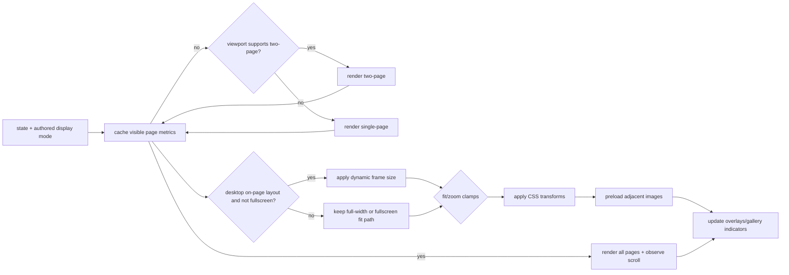

# Battle Bros Reader Overview

This document summarizes how the reader portion of the site is organized, what each module does, and the runtime flow. It excludes the admin panel.

## Entry Point and Data

- `reader/app.js` coordinates the reader bootstrap, keeps the static shell hidden until the initial page source is resolved, fetches content, wires UI handlers, and kicks off rendering.
- Data sources: entry page images under `comics/<seriesId>/entries/` (public) or `protected/comics/<seriesId>/entries/` (premium/private), `/data.json` / `/series/<id>/data.json` (entries + status + metadata + per-series labels), `/api/pages/home/<seriesId>` as the effective builder-page source for the series root when no explicit `?page=` slug is present, `/api/pages/<seriesId>/<slug>` for explicit series page requests, `/api/pages/global/by-slug/<slug>` for explicit global page requests, `/api/admin/pages/home/<seriesId>`, `/api/admin/pages/series/<seriesId>/by-slug/<slug>`, and `/api/admin/pages/global/by-slug/<slug>` for admin draft preview flows, and `/api/posts/latest` for the “latest update” widget. The homepage resolver currently prefers the page marked homepage and falls back to the same-series bound published reader page if needed. Reader requests `protected/*` paths via `/api/protected/*`. Legacy `/page-config.json` is no longer a normal startup source; `reader/safe-mode.js` remains its intentional runtime recovery consumer.

## Modules

- `reader/config.js` — Tunables for layout/zoom, keyboard settings, debounce intervals; includes `TWO_PAGE_ASPECT_RATIO` (0.714).
- `reader/data.js` — Fetches entries/media/posts, resolves explicit builder pages or the effective homepage page, normalizes JSON, and provides simple caching helpers. It now resolves header state once so the same normalized object drives both visible copy and live topbar layout.
- `reader/entries.js` — Entry navigation helpers (next/prev resolution, slug/name mapping, index clamping).
- `reader/state.js` — Central mutable state (entry, page, zoom, layout, overlays). Persists page
  progress plus vertical `scrollRatio` via `localStorage`, caches natural page metrics, and remembers
  the last successful on-page frame.
- `reader/shell-state.js` — Resolves and publishes whether the current builder page has an effective
  Comic Reader module. Reader-only features wait for or subscribe to this state.
- `reader/display-mode.js` — Normalizes the active `paged` or `vertical-scroll` mode from the
  reader-module settings applied to the body.
- `reader/dom.js` — Cached DOM lookups and small helper methods to avoid repeated queries, including `#mainContent` for desktop frame sizing.
- `reader/render.js` — Branches between paged and vertical rendering, handles preloading, caches
  natural page metrics, triggers paged dynamic-frame updates, and manages normal/Coming Soon empty
  states.
- `reader/vertical.js` — Renders every page into a continuous `#verticalStrip`, tracks the active
  page with scroll geometry/IntersectionObserver, saves scroll progress, and cleans up on mode,
  entry, or shell transitions.
- `reader/controls.js` — Wires buttons/keyboard/toolbar actions to state updates and rendering; debounced scroll/page navigation.
- `reader/transform.js` — Zoom/pan math and clamping; sizes the non-fullscreen desktop reader frame to the visible page or spread and applies CSS transforms to the image container.
- `reader/pointer.js` — Pointer/touch gestures (drag-to-pan, pinch-to-zoom) hooked into `transform`;
  paged gestures no-op in vertical mode.
- `reader/fullscreen.js` — Toggles paged fullscreen mode, syncs UI indicators, and clears/restores
  the on-page frame. Fullscreen is disabled in vertical and builder-preview modes.
- `reader/overlays.js` — Manages overlays/modals (help, share, status); open/close and body scroll locking.
- `reader/gallery.js` — Thumbnail gallery rendering and selection; stays in sync with the current page.
- `reader/latest.js` — “Latest update” banner logic using posts/media to surface the newest item.
- `reader/email.js` — Builds share/email link data from the current page/entry.
- `reader/customization.js` — No-op compatibility module retained for the old script entry; waits for bootstrap state but does not fetch page-config or mutate the reader shell.
- `reader/header-layout.js` — Applies the effective page header layout to the live topbar by reusing the existing DOM blocks.
- `reader/preview-bridge.js` — Lazy-loaded only when `?builderPreview=1` is present. Sends a `REQUEST_SNAPSHOT` postMessage to the parent admin frame, validates the `SNAPSHOT` reply using the shared preview contract, and resolves with a page result that is applied to the reader shell in preview mode. In builder-editing sessions it reports target geometry, hover/select events, responsive metrics, and text-module inline-edit messages; chrome-collapsed preview sends `builderEditing: false` and does not start the target bridge. All reader side effects (analytics, live tracking, comments, email forms, chat SSO, safe-mode, user settings, fullscreen) are suppressed when this module is active.
- `assets/css/main.core.11-viewport.css` — Viewport rules for the default/fullscreen layouts and the optional `.viewport.dynamic-frame` mode.

## Runtime Flow

1. `app.js` init: set bootstrap-loading state → resolve either the effective homepage page or an
   explicitly requested builder page → resolve reader-shell state.
   - No-reader pages render authored builder content into `#builderPageContent`, hide reader-owned
     shell/topbar controls, and skip entry data, reader analytics, comments, tracking, pointer,
     fullscreen, gallery, and latest-panel initialization.
   - Active reader pages apply the reader module config before first render, fetch entries/latest
     post, and initialize the reader-owned shell.
   - **Builder preview mode** (`?builderPreview=1`): the normal page-config fetch path is skipped. `app.js` lazy-imports `reader/preview-bridge.js` and awaits a validated snapshot from the parent admin frame. The snapshot is applied via `applyBuilderPageToDOM(...)` with `previewMode: true`; all side-effect hooks are suppressed for the session. Exact iframe dimensions come from the shared preview contract: Desktop `1920x1080`, Tablet `768x1024`, and Phone `375x812`.
2. `reader/data.js` routes modules in the reader's own section to reader side panels. Other sections
   render as ordinary page content in `#builderAboveReader` or `#builderBelowReader`.
3. Controls: UI/keyboard/gesture handlers update `state` → `render` redraws → gallery/overlays sync.
4. Persistence: `state.saveProgress` writes entry/page and, in vertical mode, `scrollRatio` to
   `localStorage`; errors are caught so reading is not blocked.
5. Layout:
   - `paged` chooses single vs two-page mode, supports zoom/pan/fullscreen, and applies desktop
     dynamic-frame sizing when eligible.
   - `vertical-scroll` renders all pages in document order, uses native scrolling and visibility for
     progress/analytics, and disables paged-only zoom/pan/swipe/fullscreen behavior.

## Visual Flow (Reader)

```mermaid
flowchart TD
  A[app.js init] --> B[apply bootstrap-loading state]
  B --> C[resolve builder page]
  C --> D{effective reader module?}
  D -- no --> N[render authored page without reader shell]
  D -- yes --> E[apply reader config + fetch entries/latest]
  E --> M{display mode}
  M -- paged --> P[render page or spread]
  M -- vertical --> V[render continuous vertical strip]
  N --> F[release bootstrap state]
  P --> F
  V --> F
  F --> G[attach allowed controls/overlays]
  G --> H[User input (click/keys/gesture)]
  H --> I[controls updates state]
  I --> J[render redraws]
  J --> K[gallery + overlays sync]
  I --> L[saveProgress → localStorage (best effort)]
  J --> M[preload next/prev images]
```

### Render Decision Flow



## Testing

- Vitest covers shell activation/inactivation, builder-page application, scheduled empty states,
  paged/vertical rendering, vertical analytics/progress, pointer/fullscreen guards, responsive
  reader config, and desktop frame math.
- Key files include `tests/reader-app.test.js`, `tests/reader-data-builder.test.js`,
  `tests/reader-entry-publication.test.js`, `tests/reader-vertical.test.js`,
  `tests/reader-vertical-analytics.test.js`, `tests/render.test.js`, and
  `tests/on-page-frame.test.js`.
- Playwright verifies no-reader, customized paged, vertical, authored above/below-reader content, and
  public/admin preview parity at desktop, tablet, and mobile widths.
