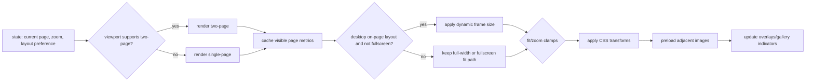

# Battle Bros Reader Overview

This document summarizes how the reader portion of the site is organized, what each module does, and the runtime flow. It excludes the admin panel.

## Entry Point and Data

- `reader/app.js` coordinates the reader bootstrap, keeps the static shell hidden until the initial page source is resolved, fetches content, wires UI handlers, and kicks off rendering.
- Data sources: entry page images under `comics/<seriesId>/entries/` (public) or `protected/comics/<seriesId>/entries/` (premium/private), `/data.json` / `/series/<id>/data.json` (entries + status + metadata + per-series labels), `/api/pages/home/<seriesId>` as the effective builder-page source for the series root when no explicit `?page=` slug is present, `/api/pages/<seriesId>/<slug>` for explicit builder-page requests, `/api/admin/pages/home/<seriesId>` and `/api/admin/pages/by-slug/<seriesId>/<slug>` for admin draft preview flows, and `/api/posts/latest` for the “latest update” widget. The homepage resolver currently prefers the page marked homepage and falls back to the published `reader` page if needed. Reader requests `protected/*` paths via `/api/protected/*`. Legacy `/page-config.json` is no longer a normal startup source; `reader/safe-mode.js` remains its intentional runtime recovery consumer.

## Modules

- `reader/config.js` — Tunables for layout/zoom, keyboard settings, debounce intervals; includes `TWO_PAGE_ASPECT_RATIO` (0.714).
- `reader/data.js` — Fetches entries/media/posts, resolves explicit builder pages or the effective homepage page, normalizes JSON, and provides simple caching helpers. It now resolves header state once so the same normalized object drives both visible copy and live topbar layout.
- `reader/entries.js` — Entry navigation helpers (next/prev resolution, slug/name mapping, index clamping).
- `reader/state.js` — Central mutable state (entry, page, zoom, layout, overlays). Persists progress via `localStorage`, caches natural page metrics, and remembers the last successful on-page frame.
- `reader/dom.js` — Cached DOM lookups and small helper methods to avoid repeated queries, including `#mainContent` for desktop frame sizing.
- `reader/render.js` — Draws the current page(s) (single/two-page), handles preloading, caches natural page metrics, triggers dynamic on-page frame updates, and manages skeleton/empty states.
- `reader/controls.js` — Wires buttons/keyboard/toolbar actions to state updates and rendering; debounced scroll/page navigation.
- `reader/transform.js` — Zoom/pan math and clamping; sizes the non-fullscreen desktop reader frame to the visible page or spread and applies CSS transforms to the image container.
- `reader/pointer.js` — Pointer/touch gestures (drag-to-pan, pinch-to-zoom) hooked into `transform`.
- `reader/fullscreen.js` — Toggles fullscreen mode, syncs UI indicators, and clears/restores the on-page frame around fullscreen transitions.
- `reader/overlays.js` — Manages overlays/modals (help, share, status); open/close and body scroll locking.
- `reader/gallery.js` — Thumbnail gallery rendering and selection; stays in sync with the current page.
- `reader/latest.js` — “Latest update” banner logic using posts/media to surface the newest item.
- `reader/email.js` — Builds share/email link data from the current page/entry.
- `reader/customization.js` — No-op compatibility module retained for the old script entry; waits for bootstrap state but does not fetch page-config or mutate the reader shell.
- `reader/header-layout.js` — Applies the effective page header layout to the live topbar by reusing the existing DOM blocks.
- `assets/css/main.core.11-viewport.css` — Viewport rules for the default/fullscreen layouts and the optional `.viewport.dynamic-frame` mode.

## Runtime Flow

1. `app.js` init: set bootstrap-loading state → fetch entries + resolve either the effective homepage page or an explicitly requested builder page, plus latest post → render initial page(s) and attach controls → reapply the builder page as the final DOM state when the builder source wins → release bootstrap state.
2. Controls: UI/keyboard/gesture handlers update `state` → `render` redraws → `gallery`/overlays sync to the new state.
3. Persistence: `state.saveProgress` writes entry/page to `localStorage`; errors are caught so reading is not blocked.
4. Layout: `render` chooses single vs two-page mode based on the aspect ratio threshold (`TWO_PAGE_ASPECT_RATIO`), caches visible page dimensions, and in the fixed-height desktop layout resizes the viewport frame to the visible page or spread. Stacked/mobile keeps the existing full-width flow, and fullscreen stays on the height-fit path.

## Visual Flow (Reader)

```mermaid
flowchart TD
  A[app.js init] --> B[apply bootstrap-loading state]
  B --> C[load config/state]
  C --> D[fetch entries + builder page + latest post]
  D --> E[render initial page(s)]
  E --> F[release bootstrap state]
  F --> G[attach controls/pointer/overlays/fullscreen/gallery]
  G --> H[User input (click/keys/gesture)]
  H --> I[controls updates state]
  I --> J[render redraws]
  J --> K[gallery + overlays sync]
  I --> L[saveProgress → localStorage (best effort)]
  J --> M[preload next/prev images]
```

### Render Decision Flow



## Testing

- Test suite: Vitest with happy-dom, covering navigation math, state persistence/error handling, render layout selection, on-page frame sizing math, and DOM regressions for page-shape changes.
- Files include `tests/entries.test.js`, `tests/state.test.js`, `tests/data.test.js`, `tests/render.test.js`, `tests/transform.test.js`, and `tests/on-page-frame.test.js`; config lives in `vitest.config.js` and `tests/setup.js`.
