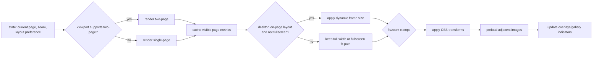

# Battle Bros Reader Overview

This document summarizes how the reader portion of the site is organized, what each module does, and the runtime flow. It excludes the admin panel.

## Entry Point and Data
- `reader/app.js` bootstraps config/state, fetches content, wires UI handlers, and kicks off rendering.
- Data sources: entry page images under `comics/<seriesId>/entries/` (public) or `protected/comics/<seriesId>/entries/` (premium/private), `/data.json` / `/series/<id>/data.json` (entries + status + metadata + per-series labels), `/page-config.json` / `/series/<id>/page-config.json` (DB-backed theme/content overrides), and `/api/posts/latest` for the “latest update” widget. Reader requests `protected/*` paths via `/api/protected/*`.

## Modules
- `reader/config.js` — Tunables for layout/zoom, keyboard settings, debounce intervals; includes `TWO_PAGE_ASPECT_RATIO` (0.714).
- `reader/data.js` — Fetches entries/media/posts, normalizes JSON, and provides simple caching helpers.
- `reader/entries.js` — Entry navigation helpers (next/prev resolution, slug/name mapping, index clamping).
- `reader/state.js` — Central mutable state (entry, page, zoom, layout, overlays). Persists progress via `localStorage`, caches natural page metrics, and remembers the last successful on-page frame.
- `reader/dom.js` — Cached DOM lookups and small helper methods to avoid repeated queries, including `#mainContent` for desktop frame sizing.
- `reader/render.js` — Draws the current page(s) (single/two-page), handles preloading, caches natural page metrics, triggers dynamic on-page frame updates, and manages skeleton/empty states.
- `reader/controls.js` — Wires buttons/keyboard/toolbar actions to state updates and rendering; debounced scroll/page navigation.
- `reader/transform.js` — Zoom/pan math and clamping; sizes the non-fullscreen desktop reader frame to the visible page or spread and applies CSS transforms to the image container.
- `reader/pointer.js` — Pointer/touch gestures (drag-to-pan, pinch-to-zoom) hooked into `transform`.
- `reader/fullscreen.js` — Toggles fullscreen mode, syncs UI indicators, and clears/restores the on-page frame around fullscreen transitions.
- `reader/overlays.js` — Manages overlays/modals (help, share, status); open/close and body scroll locking.
- `reader/gallery.js` — Thumbnail gallery rendering and selection; stays in sync with the current page.
- `reader/latest.js` — “Latest update” banner logic using posts/media to surface the newest item.
- `reader/email.js` — Builds share/email link data from the current page/entry.
- `assets/css/main.core.11-viewport.css` — Viewport rules for the default/fullscreen layouts and the optional `.viewport.dynamic-frame` mode.

## Runtime Flow
1) `app.js` init: load config/state → fetch entries + page config + latest post → render initial page(s).
2) Controls: UI/keyboard/gesture handlers update `state` → `render` redraws → `gallery`/overlays sync to the new state.
3) Persistence: `state.saveProgress` writes entry/page to `localStorage`; errors are caught so reading is not blocked.
4) Layout: `render` chooses single vs two-page mode based on the aspect ratio threshold (`TWO_PAGE_ASPECT_RATIO`), caches visible page dimensions, and in the fixed-height desktop layout resizes the viewport frame to the visible page or spread. Stacked/mobile keeps the existing full-width flow, and fullscreen stays on the height-fit path.

## Visual Flow (Reader)
```mermaid
flowchart TD
  A[app.js init] --> B[load config/state]
  B --> C[fetch entries/media/posts]
  C --> D[render initial page(s)]
  D --> E[attach controls/pointer/overlays/fullscreen/gallery]
  E --> F[User input (click/keys/gesture)]
  F --> G[controls updates state]
  G --> H[render redraws]
  H --> I[gallery + overlays sync]
  G --> J[saveProgress → localStorage (best effort)]
  H --> K[preload next/prev images]
```

### Render Decision Flow


## Testing
- Test suite: Vitest with happy-dom, covering navigation math, state persistence/error handling, render layout selection, on-page frame sizing math, and DOM regressions for page-shape changes.
- Files include `tests/chapters.test.js`, `tests/state.test.js`, `tests/render.test.js`, `tests/transform.test.js`, and `tests/on-page-frame.test.js`; config lives in `vitest.config.js` and `tests/setup.js`.
